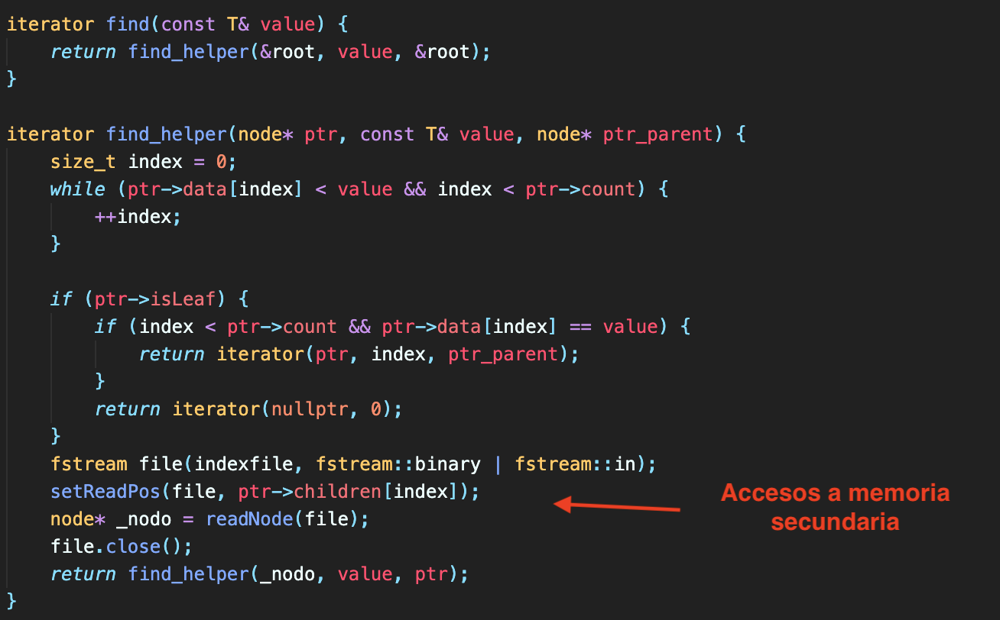

# Proyecto 1
Base de Datos 2

## Integrantes
* Benjamín Díaz
* Gabriel Spranger
* Rodrigo Céspedes

## Introducción

El objetivo del proyecto es desarrollar dos estructuras de indexación que son ampliamente usadas en el campo de las bases de datos: el árbol B+  y el static hashing. Para esto, trabajaremos sobre un dominio de datos que generamos nosotros que consisten en cuatro campos: **ID** (unsigned), **nombre** (char \[20\]), **PIN** (short), **país** (char \[35\]). Este archivo es de longitud fija. Finalmente, los resultados que deseamos obtener es que ambas estructuras de indexación hagan la búsqueda de los registros más rápida y que reduzcan el número de accesos a memoria secundaria.

## Técnicas Usadas

- Describa brevemente las técnicas de indexación de archivos que ha elegido. Explique procedimentalmente el proceso de inserción, eliminación y búsqueda.

### B+ Tree

El B+ tree es una estructura de datos que permite accesos logaritmicos a memoria secundaria. Todos los datos están almacenados en los nodos hoja y además estos están linkeados mediante una lista enlazada, lo cual permite que podamos hacer búsquedas secuenciales (búsqueda por rango). 

#### Búsqueda

A la función que hace la búsqueda, le pasamo el key del registro que queremos encontrar. Inicialmente, se hace la llamada desde el root, ya que a este siempre lo tenemos en memoria principal. Luego, ubicamos el puntero al hijo correcto para que hagamos la búsqueda recursiva. Cabe resaltar que como estamos manejando el B+ en disco, este "puntero" es en realidad un offset en el archivo donde tenemos todos los nodos guardados. Luego de ubicar el children (offset) correcto para poder hacer la búsqueda recursiva, leemos el nodo de disco mediante la función **readNode** y le pasamos como parámetro el archivo y el offset, el cual es igual a **ptr->children[index]**. Leemos ese nodo, y se lo pasamos a la llamada recursiva para continuar con la búsqueda. En caso de que el nodo en el que nos encontremos, en el proceso de la búsqueda, sea un nodo hoja, entonces iteramos sobre los keys de ese nodo para ver si está el key que queríamos encontrar, si es así, entonces retornamos un iterador a ese nodo, con la posición (index) del key que encontramos, sino, retornamos nullptr, ya que no podemos seguir buscando recursivamente.

#### Inserción

Tenemos dos tipos funciones que se encargan de la inserción: **insert_into** y **insert**. **insert_into** se encarga de insertar el key y acomodar los children y los registros de cada nodo, es decir, solo inserta el dato en el nodo. Luego, **insert**, mira si el número de keys en el nodo ha sobrepasado el orden del árbol, si es así, entonces hacemos el split, sino, dejamos el nodo como está. Ahora, **insert**, usa la misma técnica que usamos en el find para encontrar la posición correcta del key para poder insertarlo. Hay dos casos mientras hacemos esta búsqueda recursiva: el nodo en el que estamos es un nodo interno o es un nodo hoja. Cuando estamos en un nodo interno, localizamos el índice por el que tenemos que continuar la búsqueda y leemos el hijo en esa posición, es decir, llamamos **readNode** y le pasamos como parámetro el archivo y el offset, el cual es igual a **ptr->children[index]**. Una vez que hemos leído ese nodo, continuamos la búsqueda recursiva. Cuando regresamos de la llamada recursiva, vemos si el estado es OK o OVERFLOW, si es OK, entonces solo escribimos el nodo en memoria secundaria, ya que lo hemos modificado, si es OVERFLOW, entonces llamamos split. Split lo que hace es crear dos nuevos nodos, copiar los hijos, keys y registros del nodo que se va a splitear a ambos hijos y luego escribe en memoria secundaria ese mismo nodo (ya que acaba de ser modificado), y sus dos nuevos hijos. Cuando estamos en un nodo hoja, simplemente llamamos a la función **insert_into** para insertar el key y el registro en la posición correcta en el nodo y luego escribimos ese nodo en disco, ya que lo acabamos de modificar. Hacemos un procedimiento análogo con el root, el cual tiene su propio método **split_root** el cual es casi igual al **split**.

### Static Hashing

El static hashing es una técnica utilizada para almacenar datos y llevar un registro de posiciones para acceso rápido en un set de datos no ordenados. Permite accesos en O(1 + ko), k siendo el factor de bloque de los buckets que vamos a utilizar y o siendo el numero de buckets de overflow que existan para esa llave hasheada. Este método de indexación consta de una tabla hash, como key se tiene la llave del registro (pasada por una función hash) y como value se tiene la dirección lógica del bucket que le corresponde a esa llave hasheada. 

Cada Bucket tiene k espacios para almacenar registros y un puntero de overflow, cuando existe overflow, se revisa si es que existen buckets linkeados con espacio disponible, si no es así, se crea uno nuevo y se inserta ahí, los punteros de overflow se actualizan en cada iteración.

La tabla hash también se guarda en disco al terminar el programa, se guarda una lista de keys y values y se reconstruye cuando se inicia el programa.

#### Búsqueda

Para la búsqueda se provee una llave. Esta llave es hasheada aplicando módulo con la capacidad del Static Hash (definida previamente en el constructor). 

Paso 1:
Se busca dentro del hash, si es que no existe una entrada, se imprime en pantalla que no ha sido encontrado, pero si si existe una entrada accede al archivo de buckets en la posición dada por el value de esa entrada del hash, construye el bucket y va al paso 2.
Paso 2:
Se revisa dentro de el bucket de manera lineal O(k) si es que existe un registro con la llave provista . Si es que lo encuentra, imprime el valor, si es que no, se va al paso 3.
Paso 3:
Se revisa si existe un puntero de overflow con una dirección válida en el bucket, si es que no existe, se imprime en pantalla que no ha sido encontrado, si es que si, se carga el bucket de overflow en memoria accediendo a su dirección y se regresa al paso 2.

#### Inserción

La inserción se hace de manera análoga a la búsqueda. Primero se hashea la llave del registro provisto y se revisa si existe una entrada en la tabla hash, si existe, se procede al proceso A. Si no existe, se procede al proceso B.

A:
Se revisa si hay espacio disponible para insertar y lo inserta. Si no, se revisa si tiene un bucket de overflow, si lo tiene se accede a él y se repite el proceso A. Si no tiene espacio y no tiene bucket de overflow, lo crea, linkea los punteros y lo inserta en el archivo de datos en la última posición.

B:
Se crea un nuevo bucket, se crea la entrada en el hash, se inserta el registro en el bucket y luego se inserta el bucket al final del archivos de datos

### B+ Tree

### Static Hashing

## Resultados Experimentales

- Cuadro y/o gráfico comparativo de desempeño de las técnicas de indexación de archivos sobre el dominio de datos. Tanto para inserción como para búsqueda.
- Considerar dos métricas: total de accesos a disco duro (read & write) y tiempo de ejecución en milisegundos.

### B+ Tree v.s Static Hashing

- Discusión y Análisis de los resultados experimentales.

### Discusión y Análisis

(interpretar los resultados de la tabla anterior)

## Observaciones

* Compilar con C++ 17.

